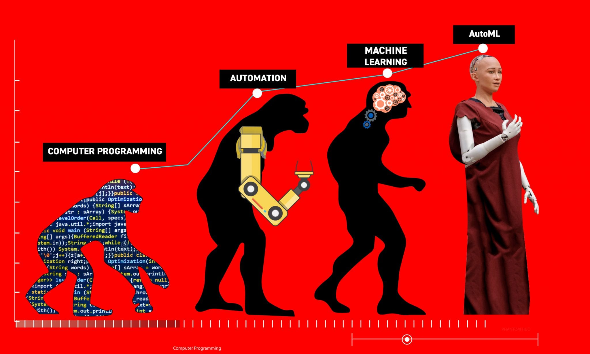
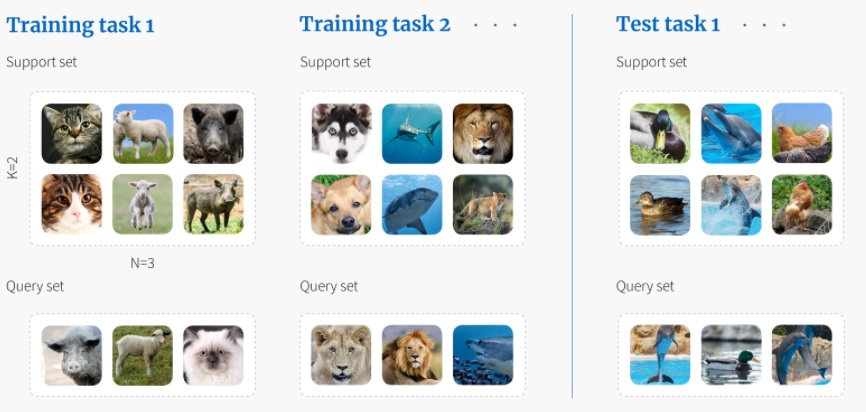

<title>AI Blog</title>

# Introduction to Meta-Learning for Neural Networks

The wish to build *Artificial Intelligence* (AI) dates back hundreds of years ago. With the rise of computers, this wish has become absolute reality, although one could philosophize about when we can call something intelligent. AI researchers are notoriously pessimistic: after solving a difficult problem that seemed to require intelligence, they suddenly seem to change their minds. "I solved this problem! But the algorithm does simply this and that... That is not intelligent!". We are less pessimistic, and argue that any program that produces behavior that would otherwise require human intelligence, can be called an AI, following one of the definitions in [(Russel and Norvig; 2020)](http://aima.cs.berkeley.edu/).

Looking back, it seems like the field of AI has grown in distinct stages. At the start, we explicitly wrote instructions to computers to perform certain tasks (e.g., write a search algorithm to play chess). This approach was successful to some extent (e.g., deep blue won from Kasparov at chess), but is not very flexible, as we can only solve tasks for which we can develop explicit procedures. As it turns out, there are many tasks for which it is extremely difficult to write these procedures! Think about all the things that humans do on a daily basis: recognizing faces, moving and navigating in the world, and making complex decisions. 

Due to these limitations, the field of AI has evolved. Instead of explicitly programming computers to do tasks, the idea is to write programs that can learn how to do tasks themselves! In modern times, we do this very successfully, as can be seen by the huge accomplishments that have been achieved due to deep neural networks! Despite these great advances, there are some drawbacks too. That is, neural networks often require lots and lots of data, and large computational resources. 

At this point in time, we are slowly transitioning into the next stage of AI evolution. Moving away from writing explicit computer instructions, or programs that learn, we now attempt to write programs that *learn to learn*. In this way, the programs can learn how they should learn properly from less data points and with smaller computational budgets. The field that studies such algorithms is called *meta-learning*. This evolution of AI is summarized in the figure below. 

 

In order to understand the difference between meta-learning and regular, or base-level learning, you have to keep in mind the objectives. In regular learning, we often wish to achieve good performance on a single task. In meta-learning, however, our objective is to find a good learning algorithm that will perform well. When does a learning algorithm perform well? When it can learn various things (tasks) well! Thus, we search this learning algorithm over a set of tasks, instead of a single one, as done in regular learning. This is precisely the difference: the level at which we learn has changed. We went up a layer of abstraction (from base- to meta-level), and deal with a set of tasks. The figure shows the difference in training data used for the different levels of learning. 

A specific instantiation of this generic setup, called few-shot learning, is commonly used in today's research on meta-learning. Here, few-shot refers to the fact that only few examples in the train sets of tasks are available to learn from. This is a natural fit for meta-learning, as it is computationally cheap, and good learning performance from few examples indicates good learning ability. 

The most common setup is perhaps *N-way, k-shot* classification, where every train set of a task contains k examples for each of the N classes. Furthermore, the test set contains examples from these N classes, such that we can measure how well our algorithm has learned the N concepts. 
For sufficiently small k, we can call this approach *few-shot learning*. The figure below shows an example of N-way, k-shot classification, from this [source](https://www.borealisai.com/en/blog/tutorial-2-few-shot-learning-and-meta-learning-i/).

In this blog, we will investigate various algorithms that attempt to exploit the problem setup in order to achieve faster learning in neural networks, something which would greatly increase their applicability in the real world!

