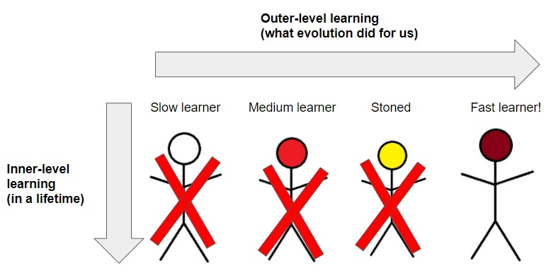
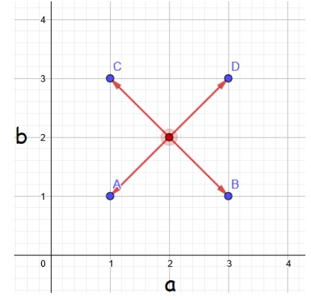
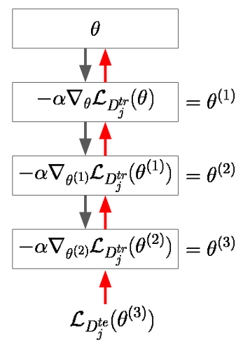
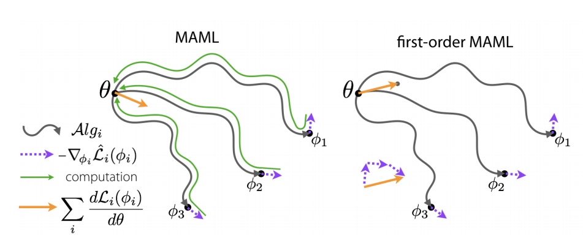

<head>
<title>AI Blog</title>

</head>
# Model-Agnostic Meta-Learning (MAML)

## Motivation 
Deep neural networks have been shown to be extremely successful, yielding human- or even super-human level performance on various tasks ranging from image recognition to playing games (chess, go, ...).
Despite these amazing achievements, deep neural networks are very limited in their ability in to learn new tasks quickly (from little data). This makes them inapplicable in many real-world domains where little data and computational resources are available [(Hospedales et al. (2020))](https://arxiv.org/pdf/2004.05439.pdf). Naturally, this raises the question how we can enable these networks to learn *quickly* (from less data).

As mentioned in our [primer](https://mikehuisman.github.io/aiblog/posts/intro-metalearning/page.md), meta-learning is an approach to do precisely that! Meta-learning is inspired by ideas in evolution where individuals may have been selected for fast learning ability (as they would be able to gain a natural advantage over slower learners). Thus, evolution may have imprinted some *prior* in our brains that allows for fast learning on a life-time basis. Note that learning happens on two different levels: at the *outer-level*, evolution "searches" for a prior that allows for fast learning at the *inner-level* (on a lifetime basis). This double-loop learning process is visualized in the figure below (image from our [youtube video](https://www.youtube.com/watch?v=2Ipb3F4GlL4)). 

<figure>
    
</figure>

Meta-learning approaches mimic this double-loop learning process. In this blog post, we cover (arguably) the most influential work in the field of deep meta-learning, namely model-agnostic meta-learning, or MAML, created by [Finn et al. (2017)](https://arxiv.org/pdf/1703.03400.pdf). 

## Intuition behind MAML

The key idea of MAML is equivalent to that of the double-loop learning process in nature, with the only difference that we assume that the network architecture is fixed. "Well, if the network architecture is fixed then what kind of prior is there to learn?" you may ask. The answer is very simple. We want to find an initialization of the network parameters (weights) from which we can quickly learn new tasks. This idea is captured in the figure below. That is, suppose we have a network with only two parameters: a and b, and 4 tasks that we want to be able to learn quickly (A, B, C, and D). Naturally, we will want our initial weights in a centralized position which allows us to quickly move towards the optimal parameters for the different tasks. In this case, that prior corresponds to the center of the square imposed by the points A, B, C, and D.

<figure>
    
</figure>

Also note that neural network optimization landscapes are not bowl-shaped. Thus, there may be tons of local minima in which you can get trapped by performing regular gradient descent on the loss function. The initialization parameters of your network thus influence the final point that you will arrive at after learning for some time steps T. Furthermore, the closer your initialization to the right solution, the faster the learning process will be! 

## Tasks 
In order to properly understand MAML, it is crucial to understand what tasks are and how they are composed. MAML was developed for the setting where tasks consist of two parts: a *support set* and a *query set*. Using this setup, our network can learn new tasks by making some updates on the support set. The success of this inner-level learning can then be measured in the query set. Note that the support and query sets correspond to regular train and test sets of examples (in our case). For more information on the tasks, please refer to our [previous blog post](https://mikehuisman.github.io/aiblog/posts/intro-metalearning/page.html).

## Formalizing MAML

Let us denote a task $j$ as $\mathcal{T}_j = (D^{tr}_j, D^{te}_j)$, consisting of a support set $D^{tr}_j$ and query set $D^{te}_j$. Next, suppose we have a fixed base-learner (neural) network with parameters $\theta$. Then, given a new task $\mathcal{T}_j$, our goal is to learn the task as well as possible within $s$ gradient update steps on the support set $D^{tr}_j$. As mentioned earlier, the success of learning on the support set is measured on the query set $D^{te}_j$.

Thus, given the task $\mathcal{T}_j$, our network updates its parameters using gradient descent for $s$ steps:

$\theta_j^{(1)} := \theta - \alpha \nabla_{\theta} \mathcal{L}_{D^{tr}_j}(\theta),$

$\theta_j^{(2)} := \theta^{(1)} - \alpha \nabla_{\theta^{(1)}} \mathcal{L}_{D^{tr}_j}(\theta^{(1)}),$

$...$

$\theta_j^{(s)} := \theta^{(s-1)} - \alpha \nabla_{\theta^{(s-1)}} \mathcal{L}_{D^{tr}_j}(\theta^{(s-1)}),$ 
where $\alpha$ is the learning rate of gradient descent.

We can then use the loss on the query set $\mathcal{L}_{D^{te}_j}(\theta^{(s)})$ (which indicates how successful our learning has been) and propagate it backwards through the computational graph to update our initial parameters to facilitate faster learning. 
An example of such a computational graph is shown in the figure below. In this figure, we make $s=3$ updates on a single task. The gray-ish arrows downward indicate task-specific updates using the gradients of the current parameters. The red arrows upward indicate how the gradients with respect to the query set loss bubble up, allowing us to update the initial parameters $\theta$.

<figure>
    
</figure>

If our learning was succesful, then we expect our network to be able to generalize to the query set of the task $D^{te}_j$, which was not used for training. 
Of course, we do not want to restrict ourselves to a single task, for a good learning procedure is able to learn many tasks! 

Suppose we have some distribution of tasks $p(\mathcal{T})$ which assigns a probability to invidual tasks $\mathcal{T}_j$. Then, we wish to maximize our learning ability by adapting our initial set of parameters $\theta$. This is precisely the objective function of MAML! More mathematically precise, we wish to find

$\theta \theta \theta \theta \theta \theta \theta \theta$

$\mathbb{E}_{\mathcal{T}_j \backsim p(\mathcal{T})}$ $(\mathcal{L}_{D_j^{tr}}(\theta_j^{(s)}))$

$\mathbb{E}_{\mathcal{T}_j \backsim p(\mathcal{T})} (\mathcal{L}_{D_j^{tr}} (\theta_j^{(s)}))$

$argmin_{\theta} \mathbb{E}_{\mathcal{T}_j \backsim p(\mathcal{T})}$ test  $\mathcal{L}_{D_j^{tr}} (\theta_j^{(s)})$

Or in words, the initialization from which we can quickly learn other tasks. 
See the analogy with the double-loop learning process in nature? At the inner-level, we are presented with a task $\mathcal{T}_j$ and make some updates. At the outer-level, we wish to find a better initialization $\theta$ from which we can learn various tasks more quickly. The only difference with evolution is that the individuals (neural networks for each task) share the same initialization! 

Now as you have already seen in the above image (computation graph), we have to propagate backwards through all updates that we have made on individual tasks. This means that we have to compute the gradient of gradients, which requires the computation of second-order derivatives. This can be very expensive in terms of running time and memory cost. Fortunately, [Finn et al. (2017)](https://arxiv.org/pdf/1703.03400.pdf) have shown that a first-order approximation of MAML works just as well! 

In the first-order variant of MAML, we ignore all previous weight updates that we have made for specific tasks, and simply evaluate the gradient of our task-specific parameters $\theta^{(s)}_j$ with respect to the query set, and update our initialization in that direction. The difference between second- and first-order MAML is nicely displayed in the image below, taken from [Rajeswaran et al. (2019)](https://papers.nips.cc/paper/2019/file/072b030ba126b2f4b2374f342be9ed44-Paper.pdf). Note that they use $\psi_j$ to denote fast-weights $\theta^{(s)}_j$

<figure>
    
</figure>

## The algorithm

The pseudocode for MAML is shown in the code block below.

1. Randomly initialize weights $\theta$
2. While stopping criterion not met:
3.     Sample batch of $J$ tasks $B = \mathcal{T}_j$ for $j=1,...,J$
4.     For every task $\mathcal{T}_j = (D^{tr}_j, D^{te}_j) \in B$:
5.         Compute $\theta^{(s)}_j$ using regular gradient descent on the support set $D^{tr}_j$ with learning rate $\alpha$
6.     Update the initialization $ \theta := \theta - \beta \nabla_{ \theta } \sum \mathcal{L}_{ D^{te}_{j} } (\theta^{(s)}_{j}) $

